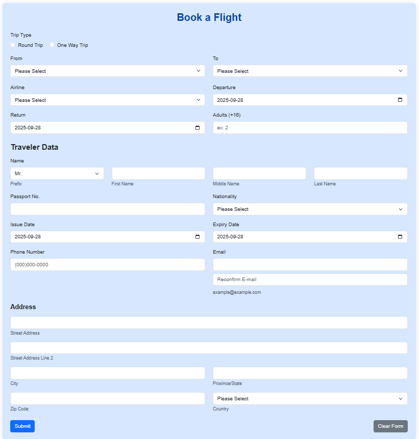
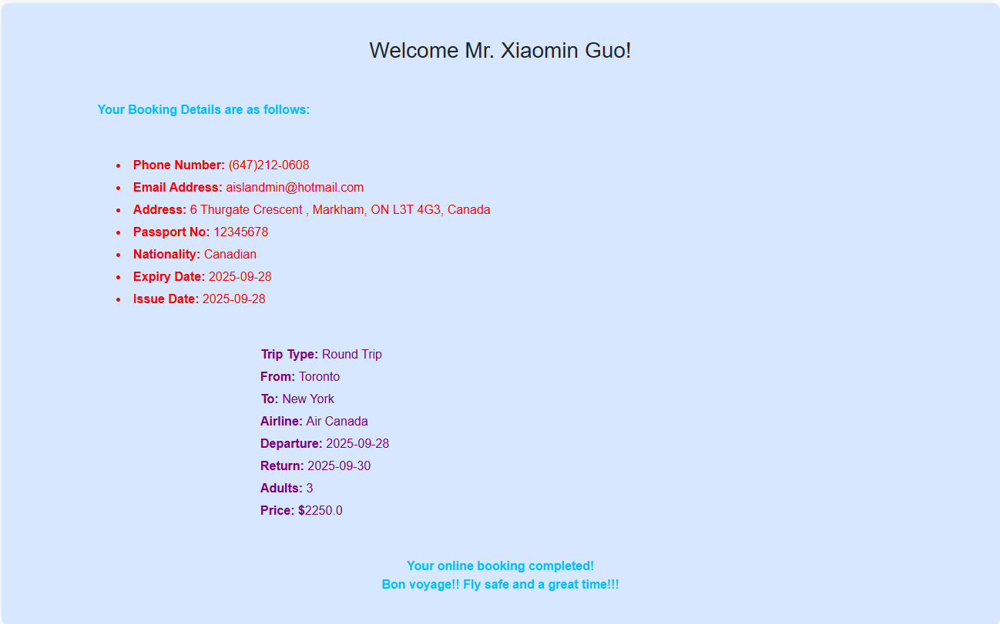

# Flight Booking Web Application

Due to increased demand for digital travel services, CenTrip Airlines has decided to offer an online flight booking platform. Spring Boot Web MVC Application is developed to handle user flight booking requests efficiently.

- A Controller Java file to handle flight booking requests.  
- A Model Java file to encapsulate booking data.  
- HTML Thymeleaf view files to interact with users.  
- A Maven POM.xml file to manage project dependencies.  

---

## Task 1

Design an HTML page named `index.html` using Thymeleaf. This page should handle a POST request mapped to an action on a `FlightBookingController` Java class using `@RequestMapping`. The page contains a **“Book a Flight”** form to collect user input.

- Add a **Submit** button to submit the form.  
- Include a **Clear Form** button to clear user input.  
- Implement basic HTML validation using input attributes such as:  
  - `type="email"` for email  
  - `type="date"` for dates  
  - `min`, `max`, or `pattern` where appropriate  
- Use appropriate form controls:  
  - Text fields, date pickers, dropdowns, radio buttons, and textareas (if needed)  
- Implement basic JavaScript validation (if needed)  
- Apply a clean and responsive layout using `
` elements (or tables, if preferred)  
- Enhance the design using:  
  - Background color or gradients  
  - Font styles  
  - CSS formatting (either inline or via a CSS file)  

A minimum of five cities can be chosen for departure and destination, including:  

- Toronto  
- New York  
- Paris  
- London  
- Amsterdam  

Prices should be calculated based on the trip type selected: **One-Way** or **Round-Trip**.  

Example:  
- One-Way trip from Toronto to Paris: $1,600.00  
- Round-Trip from Toronto to Paris: $1,950.00  

> Note: You may define your own pricing for trips between different city pairs.  

Both departure and return dates must be **future dates** (i.e., after the current date).  

---

## Task 2

Define a model bean class `Booking.java` with the appropriate properties and methods to handle the user input data.  

---

## Task 3

Define a `FlightBookingController.java` class to get the data from `index.html` form page and publish the output as the following format in the `show-booking.html` page.  

---

## Screenshots

 
